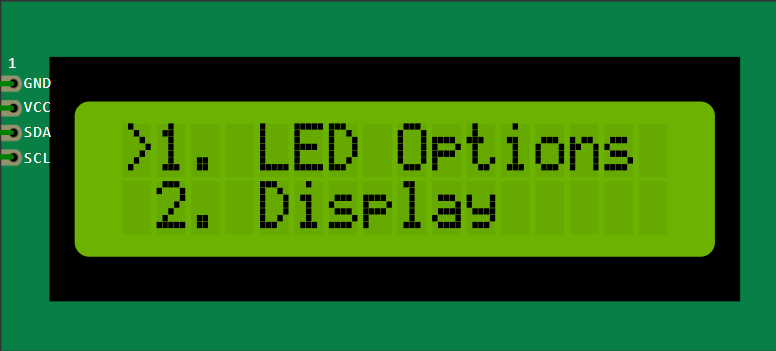

# unoMenu 

This is a simple project designed to run on an Arduino Uno. It features a multi-layered menu which allows you to: 
- control three LEDs (or a single RGB one)
- change how the LCD displays the menu
- read temperature from two DS18B20 Temperature probes

### IMPORTANT
**This project is designed around a 16x2 I2C LCD display!**

## Pinout

| Pin | Connection                              |
|----:|-----------------------------------------|
|  D2 | Enter button                            |
|  D3 | Anode (+) of blue LED                   |
|  D4 | Exit Button                             |
|  D5 | Anode (+) of green LED                  |
|  D6 | Anode (+) of red LED                    |
|  A1 | OneWire connection to temperatue probes |
|  A2 | CLK encoder signal                      |
|  A3 | DT encoder signal                       |
|  A4 | LCD SDA pin                             |
|  A5 | LCD SCL pin                             |